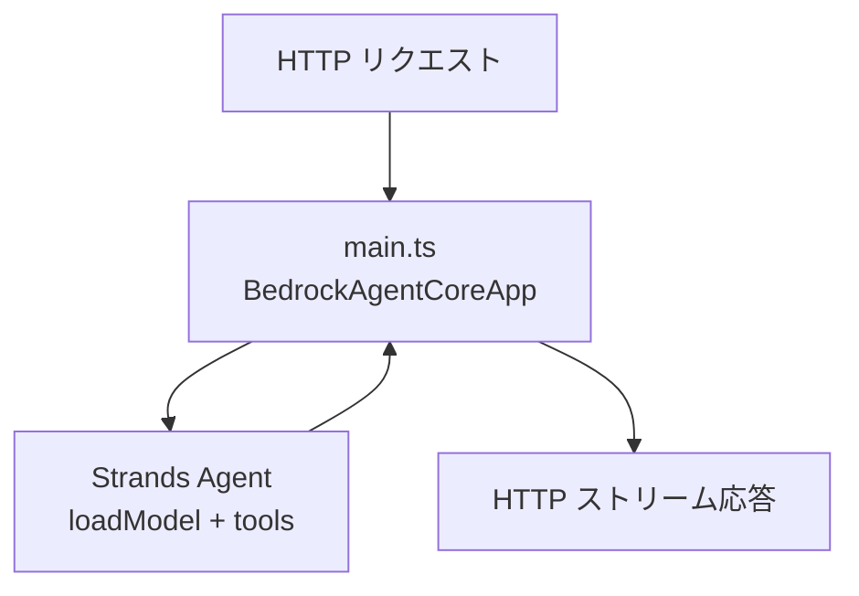
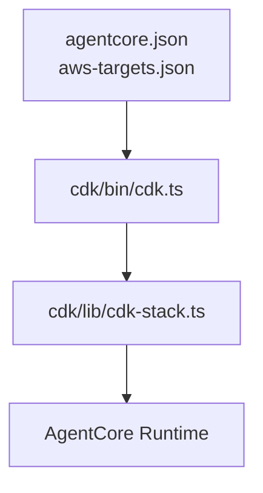

## はじめに

**AgentCore CLI** の `agentcore create` を実行したとき、ローカルに何ができるのかを整理する記事です。[TypeScript 向け公式チュートリアル](https://docs.aws.amazon.com/ja_jp/bedrock-agentcore/latest/devguide/runtime-get-started-cli-typescript.html)の説明と、手元で生成されたファイルを突き合わせています。

今回はウィザードで **TypeScript** + **Strands** + **HTTP** を選びました。

:::note info
ディレクトリ構成やソースの読み解き、文章の整理には生成 AI を使用しました。`agentcore create` の実行とログ・ファイルの中身は、手元の環境で確認しています。気になる箇所があれば、ご指摘いただけると助かります。
:::

## AgentCore CLI とは

**AgentCore CLI** は、[Amazon Bedrock AgentCore](https://aws.amazon.com/bedrock/agentcore/) 向けのコマンドラインツールです。npm パッケージ `@aws/agentcore` として配布され、次のような作業をまとめて行えます。

| 用途 | 代表コマンド | 概要 |
|:-----|:-------------|:-----|
| プロジェクト作成 | `agentcore create` | エージェント用のディレクトリ・設定・サンプルコードを生成 |
| ローカル開発 | `agentcore dev` | 開発サーバとインスペクタで動作確認 |
| AWS へのデプロイ | `agentcore deploy` | `agentcore.json` 等をもとに CDK で Runtime などを作成 |
| 呼び出し | `agentcore invoke` | ローカルまたはデプロイ済みエージェントへプロンプト送信 |
| 運用確認 | `agentcore status` / `logs` / `traces` | デプロイ状態・ログ・トレースの確認 |

エージェント本体の実装には、**Strands**、LangChain / LangGraph、Google ADK、OpenAI Agents などのフレームワークを選べます（[TypeScript 向け Getting started](https://docs.aws.amazon.com/ja_jp/bedrock-agentcore/latest/devguide/runtime-get-started-cli-typescript.html) 参照）。プロジェクト直下の `agentcore/agentcore.json` にランタイムやメモリなどを宣言し、`app/<エージェント名>/` にアプリコードを置く構成です。

TypeScript プロジェクトでは **Node.js 22+** と **AWS CDK** が前提です（公式の [Prerequisites](https://docs.aws.amazon.com/ja_jp/bedrock-agentcore/latest/devguide/runtime-get-started-cli-typescript.html#runtime-get-started-cli-typescript-prerequisites) 参照）。

`agentcore create` は **AWS 上にリソースを作るコマンドではありません**。ローカルにひな型を用意し、デプロイは `agentcore deploy`（内部で AWS CDK）が担います。本記事では、この **create の直後** にディスク上に存在するものに焦点を当てます。

インストール例は次のとおりです。

```bash
npm install -g @aws/agentcore
agentcore --help
```

## 実行時に入れた値

対話ウィザード（TUI）で **明示的に入力・選択した** 項目だけをまとめています（ログ: `agentcore/.cli/logs/create/create-20260603-221508.log`）。

| 項目 | 入力 | 公式のフラグ・備考 |
|:-----|:-----|:-------------------|
| プロジェクト名 | `awsagent` | `--name`（英数字、先頭は英字、最大 36 文字） |
| エージェント（ランタイム）名 | `AWSAgent` | `app/AWSAgent/` に展開されます |
| 言語 | TypeScript | 公式例は `main.ts` / `package.json` / `tsconfig.json` |
| フレームワーク | Strands | `--framework Strands` |
| プロトコル | HTTP | ウィザードで選択（後述） |

:::note info
**作成先ディレクトリは TUI では聞かれませんでした。** `agentcore create` 実行時のカレントディレクトリに、プロジェクト名（`awsagent`）のフォルダが自動作成されます。今回の実体パスは `/Users/xxx/work/awsagent` でしたが、これは実行場所に依存する自動決定です。
:::

:::note warn
言語に **TypeScript** を選んだとき、プロトコルの選択肢は **HTTP のみ** でした。生成された `agentcore.json` も `"protocol": "HTTP"` です。
:::

### 生成結果として書き込まれた値

ウィザードでは意識して選んでいない項目も、生成された `agentcore.json` やソースに含まれます。

| 項目 | 値 | 読み取り元 |
|:-----|:-----|:-----------|
| ビルド | `CodeZip` | `agentcore.json` の `runtimes[].build` |
| モデルプロバイダ | Bedrock | `model/load.ts` の `BedrockModel` |
| メモリ | なし | `agentcore.json` の `memories: []` |
| ランタイムバージョン | `NODE_22` | `agentcore.json` の `runtimeVersion` |

非対話で近い条件にする場合、公式の [Step 2](https://docs.aws.amazon.com/ja_jp/bedrock-agentcore/latest/devguide/runtime-get-started-cli-typescript.html#runtime-get-started-cli-typescript-create-agent) では次の 2 段階です。まずプロジェクトだけ作り、`agentcore add agent` で TypeScript エージェントを追加します。

```bash:agentcore-create.sh
agentcore create --name awsagent --no-agent
cd awsagent
agentcore add agent --name AWSAgent --type create --build CodeZip --language TypeScript --framework Strands --model-provider Bedrock --memory none
```

対話ウィザード（`agentcore create` のみ）でも同じ結果に近づけられます。

## 公式ドキュメントとの構造の違い

[Step 2](https://docs.aws.amazon.com/ja_jp/bedrock-agentcore/latest/devguide/runtime-get-started-cli-typescript.html#runtime-get-started-cli-typescript-create-agent) に載っている TypeScript の最小構成は次のとおりです。

```text:公式の最小構成（TypeScript）
MyTsAgent/
  agentcore/
    agentcore.json
    aws-targets.json
  app/
    TsAgent/
      main.ts
      model/load.ts
      mcp_client/client.ts
      package.json
      tsconfig.json
```

今回できたものは、これに加えて次が含まれています。

- **`agentcore/cdk/`** … `agentcore deploy` が CDK で AWS リソースを作るためのプロジェクト
- **`AGENTS.md`**、**`agentcore/.llm-context/`** … 設定 JSON 編集時の補助（公式の最小ツリーには未記載）
- **`.env.local`**、**`README.md`** … シークレット用テンプレートとプロジェクト説明

プロジェクト名（`awsagent`）と `app/` 配下のフォルダ名（`AWSAgent`）が一致していない点も、公式例（`MyTsAgent` / `TsAgent`）とは異なります。`agentcore.json` の `runtimes[].name` と `codeLocation` が対応していれば問題ありません。

## 作成ステップ

ログの STEP 順に並べています。3 以降は追加のプロンプトはありません。

| 順番 | ステップ（ログ上の名前） | 入力・条件 | できたもの |
|:-----:|:-------------------------|:-----------|:-----------|
| 1 | Create project directory and config files | プロジェクト名 `awsagent`（作成先はカレントディレクトリに自動） | `agentcore/agentcore.json` など |
| 2 | Add agent to project | `AWSAgent`、TypeScript、Strands | `app/AWSAgent/` 以下 |
| 3 | Set up Node environment | （自動） | `app/AWSAgent` で `npm install` |
| 4 | Prepare agentcore/ directory | （自動） | `agentcore/cdk/`、`AGENTS.md` など |
| 5 | Initialize git repository | （自動） | `git init` |

:::note info
TypeScript 向け公式チュートリアルでは、create の次が [Step 3: `agentcore dev`](https://docs.aws.amazon.com/ja_jp/bedrock-agentcore/latest/devguide/runtime-get-started-cli-typescript.html#runtime-get-started-cli-typescript-test-locally)、その次が [Step 4: `agentcore deploy`](https://docs.aws.amazon.com/ja_jp/bedrock-agentcore/latest/devguide/runtime-get-started-cli-typescript.html#runtime-get-started-cli-typescript-deploy) です。**create だけでは AWS 上の Runtime は作られません。**
:::

## ディレクトリ一覧

`node_modules` と `.git` は除いています。

```text:awsagent/
awsagent/
├── README.md
├── AGENTS.md
├── agentcore/
│   ├── agentcore.json
│   ├── aws-targets.json
│   ├── .env.local
│   ├── .gitignore
│   ├── .cli/deployed-state.json
│   ├── .llm-context/
│   └── cdk/
│       ├── bin/cdk.ts
│       └── lib/cdk-stack.ts
└── app/
    └── AWSAgent/
        ├── main.ts
        ├── model/load.ts
        ├── mcp_client/client.ts
        ├── package.json
        └── tsconfig.json
```

| パス | 役割 |
|:-----|:-----|
| `agentcore/agentcore.json` | プロジェクトとランタイムの定義 |
| `agentcore/aws-targets.json` | デプロイ先（今回は `[]` のまま） |
| `app/AWSAgent/main.ts` | エージェントのエントリ（Strands + Runtime HTTP） |
| `app/AWSAgent/package.json` | 依存関係と `build` / `dev` スクリプト（`"type": "module"`） |
| `app/AWSAgent/tsconfig.json` | TypeScript コンパイル設定 |

## agentcore.json（作成直後）

```json:agentcore/agentcore.json
{
  "$schema": "https://schema.agentcore.aws.dev/v1/agentcore.json",
  "name": "awsagent",
  "version": 1,
  "managedBy": "CDK",
  "runtimes": [
    {
      "name": "AWSAgent",
      "build": "CodeZip",
      "entrypoint": "main.js",
      "codeLocation": "app/AWSAgent/",
      "runtimeVersion": "NODE_22",
      "networkMode": "PUBLIC",
      "protocol": "HTTP"
    }
  ],
  "memories": [],
  "credentials": []
}
```

（`evaluators` など他の空配列は省略しています）

| フィールド | 意味 |
|:-----------|:-----|
| `build: CodeZip` | TypeScript をコンパイルして zip 化し、S3 経由で Runtime に載せる（[Step 4: deploy](https://docs.aws.amazon.com/ja_jp/bedrock-agentcore/latest/devguide/runtime-get-started-cli-typescript.html#runtime-get-started-cli-typescript-deploy)） |
| `protocol: HTTP` | Runtime の HTTP API 形式（[HTTP protocol contract](https://docs.aws.amazon.com/bedrock-agentcore/latest/devguide/runtime-http-protocol-contract.html)） |
| `runtimeVersion: NODE_22` | TypeScript / Node 22 用 |

:::note warn
`aws-targets.json` が空のままではデプロイできません。AWS へ載せるときはターゲットを設定したうえで **`agentcore deploy`** を使います（`cdk deploy` 単体ではなく、CLI 経由が想定されています）。
:::

## 重要なソースの解説

create 直後に触ることになりそうなファイルについて、役割と処理の流れで整理します。

### 全体の流れ

**リクエスト時（`agentcore dev` / invoke）**



**デプロイ時（`agentcore deploy`）**



ローカル開発では `agentcore dev` が依存関係のインストールと TypeScript のコンパイルを行い、Runtime 相当の HTTP サーバ（既定 `http://localhost:8080`）を起動します。`package.json` の `dev` スクリプトは `tsx watch main.ts` です。デプロイ時は `agentcore deploy` が TypeScript を JavaScript にコンパイルしてパッケージ化します。`agentcore.json` の `build: CodeZip` と `entrypoint: main.js` は、そのデプロイ方式と成果物を表します。

### app/AWSAgent/main.ts

Runtime から見た HTTP の入口と、Strands エージェントをつなぐファイルです。

| 層 | ライブラリ | 役割 |
|:---|:-----------|:-----|
| HTTP / Runtime | `bedrock-agentcore/runtime` | Runtime 向けの HTTP サーバ |
| エージェント | `@strands-agents/sdk` | モデル呼び出し・ツール実行 |
| このプロジェクト | `./model/load.js` など | モデル ID・MCP・サンプルツール |

<details><summary>ツールの組み立て（抜粋）</summary>

```typescript:app/AWSAgent/main.ts
const mcpClients: McpClient[] = [getStreamableHttpMcpClient()].filter(
  (client): client is McpClient => Boolean(client)
);

const tools: ToolList = [];

const addNumbers = tool({
  name: 'add_numbers',
  description: 'Return the sum of two numbers',
  inputSchema: z.object({ a: z.number(), b: z.number() }),
  callback: async ({ a, b }) => a + b,
});
tools.push(addNumbers);
tools.push(...mcpClients);
```

</details>

<details><summary>エージェントのキャッシュとリクエスト処理（抜粋）</summary>

```typescript:app/AWSAgent/main.ts
let cachedAgent: Agent | null = null;

async function getOrCreateAgent(): Promise<Agent> {
  if (!cachedAgent) {
    const model = await loadModel();
    cachedAgent = new Agent({ model, systemPrompt: SYSTEM_PROMPT, tools });
  }
  return cachedAgent;
}

const app = new BedrockAgentCoreApp({
  invocationHandler: {
    async *process(payload: any, context: any) {
      const agent = await getOrCreateAgent();
      for await (const event of agent.stream(payload.prompt ?? '')) {
        if (
          event.type === 'modelStreamUpdateEvent' &&
          event.event?.type === 'modelContentBlockDeltaEvent' &&
          event.event.delta?.type === 'textDelta'
        ) {
          yield { data: event.event.delta.text };
        }
      }
    },
  },
});

app.run({ port: parseInt(process.env.PORT ?? '8080') });
```

</details>

- 入力は `payload.prompt` です（invoke 時のプロンプト文字列）
- ストリームイベントのうち **テキスト delta だけ** を返します
- カスタマイズの入口は `SYSTEM_PROMPT`、`tools`、`process` 内の yield 条件が中心です

### app/AWSAgent/model/load.ts

```typescript:app/AWSAgent/model/load.ts
import { BedrockModel } from '@strands-agents/sdk/models/bedrock';

export function loadModel(): BedrockModel {
  return new BedrockModel({ modelId: 'global.anthropic.claude-sonnet-4-5-20250929-v1:0' });
}
```

モデル ID の変更は、まずこのファイルを編集します（Bedrock コンソールのモデルアクセスも要確認）。

### app/AWSAgent/mcp_client/client.ts

```typescript:app/AWSAgent/mcp_client/client.ts
const EXAMPLE_MCP_ENDPOINT = 'https://mcp.exa.ai/mcp';

export function getStreamableHttpMcpClient(): McpClient {
  const transport = new StreamableHTTPClientTransport(new URL(EXAMPLE_MCP_ENDPOINT));
  return new McpClient({ transport });
}
```

Exa の公開 MCP を接続するサンプルです。`agentcore.json` の **Gateway**（`agentCoreGateways`）とは別で、アプリ内から直接 URL に繋ぐ構成です。

### app/AWSAgent/package.json と tsconfig.json

公式の最小構成にも含まれる TypeScript 用の設定です。

- **`package.json`** … `@strands-agents/sdk`、`bedrock-agentcore` などの依存関係と、`build`（`tsc`）/ `dev`（`tsx watch`）スクリプトを定義します。`"type": "module"` が付くため、import には `.js` 拡張子を付ける ESM 構成です（公式の [Common issues](https://docs.aws.amazon.com/ja_jp/bedrock-agentcore/latest/devguide/runtime-get-started-cli-typescript.html#runtime-get-started-cli-typescript-common-issues) でも言及）。
- **`tsconfig.json`** … `outDir: dist` にコンパイルし、デプロイ時の `entrypoint: main.js` と整合させます。ローカルで型エラーを確認するときは `app/AWSAgent` で `npm run build` を実行します。

### agentcore/cdk/bin/cdk.ts

`agentcore deploy` / `npx cdk synth` のエントリです。

1. `ConfigIO` で `agentcore.json` と `aws-targets.json` を読み込む
2. ターゲットが空ならエラー（`No deployment targets configured`）
3. ターゲットごとに `AgentCore-{プロジェクト名}-{ターゲット名}` スタックを `app.synth()`

```typescript:agentcore/cdk/bin/cdk.ts
if (targets.length === 0) {
  throw new Error('No deployment targets configured. Please define targets in agentcore/aws-targets.json');
}
```

### agentcore/cdk/lib/cdk-stack.ts

```typescript:agentcore/cdk/lib/cdk-stack.ts
this.application = new AgentCoreApplication(this, 'Application', appProps as any);

if (mcpSpec?.agentCoreGateways && mcpSpec.agentCoreGateways.length > 0) {
  new AgentCoreMcp(this, 'Mcp', { /* ... */ });
}
```

| コンストラクト | 今回 |
|:---------------|:-----|
| `AgentCoreApplication` | 作成される |
| `AgentCoreMcp` | Gateway 未設定のため作成されない |

ランタイムの増減は **`agentcore.json` を編集する**のが正で、`cdk-stack.ts` をいじる必要は通常ありません（`AGENTS.md` 参照）。

### 設定とソースの対応

| ファイル | 触るタイミング |
|:---------|:---------------|
| `agentcore/agentcore.json` | ランタイム追加、build、プロトコル変更時 |
| `agentcore/aws-targets.json` | 初回 deploy 前 |
| `app/AWSAgent/main.ts` | プロンプト・ツール・ストリーム形式 |
| `app/AWSAgent/package.json` | 依存関係の追加・削除時 |
| `app/AWSAgent/tsconfig.json` | コンパイル設定の調整時 |
| `app/AWSAgent/model/load.ts` | モデル ID 変更時 |
| `app/AWSAgent/mcp_client/client.ts` | 外部 MCP の URL・認証 |

## create 以降の流れ

TypeScript 向け公式チュートリアルのステップに沿った流れです。

| 公式 | コマンド | 意味 |
|:-----:|:---------|:-----|
| Step 3 | `agentcore dev` | ローカル起動・インスペクタ（`agentcore dev "プロンプト"` で即時呼び出しも可） |
| Step 4 | `agentcore deploy` | TypeScript コンパイル + パッケージ化 + CDK で Runtime 作成 |
| Step 5 | `agentcore invoke` | デプロイ済みエージェントの呼び出し（`--stream` / `--session-id` 対応） |
| Step 6 | AWS SDK / `agentcore invoke --runtime` | プログラムからの呼び出し |
| Step 7 | `agentcore remove all` → `agentcore deploy` | AWS リソースの削除 |

## まとめ

| できたもの | 中身 |
|:-----------|:-----|
| 設定 | `agentcore.json`、空の `aws-targets.json`、`.env.local` |
| アプリ | `app/AWSAgent/`（`main.ts`、`package.json`、`tsconfig.json` ほか） |
| インフラ用 | `agentcore/cdk/` |
| その他 | README・AGENTS.md、`git init` |

`agentcore create` でできるのはローカルのひな型までです。AWS へ載せるには `aws-targets.json` を設定して `agentcore deploy` を実行します。

## 参考文献

- [Get started with the AgentCore CLI in TypeScript（公式）](https://docs.aws.amazon.com/ja_jp/bedrock-agentcore/latest/devguide/runtime-get-started-cli-typescript.html "AgentCore CLI TypeScript Getting started")
- [Get started with the AgentCore CLI（Python 版・公式）](https://docs.aws.amazon.com/bedrock-agentcore/latest/devguide/runtime-get-started-cli.html "AgentCore CLI Python Getting started")
- [AgentCore CLI（GitHub）](https://github.com/aws/agentcore-cli "agentcore-cli")
- [AgentCore CDK Constructs](https://github.com/aws/agentcore-l3-cdk-constructs "agentcore-l3-cdk-constructs")
